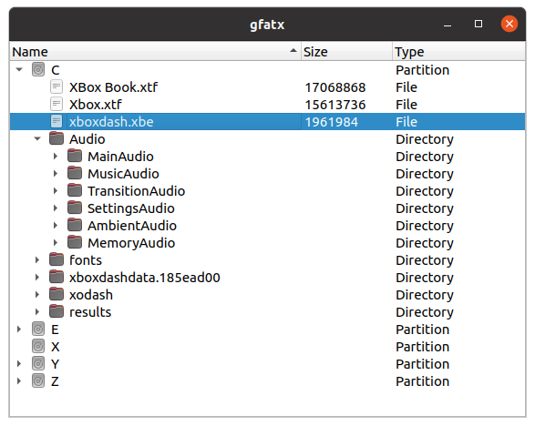

fatx
====

Original Xbox FATX Filesystem Library, Python bindings, FUSE driver, and GUI explorer.

* [**libfatx**](#libfatx) is a C library for working with the FATX filesystem, a variant of FAT16/32 developed by Microsoft for the original Xbox console.
* [**fatxfs**](#fatxfs) is a [FUSE driver](https://en.wikipedia.org/wiki/Filesystem_in_Userspace) built using libfatx.
* [**pyfatx**](#pyfatx) is a Python module providing bindings to libfatx.
* [**gfatx**](#gfatx) is a graphical utility for working with FATX disk images, built around libfatx.

libfatx
-------
**libfatx** provides both read and write access to FATX filesystems, and formatting disks. Large disks are supported via F partition.

fatxfs
------
A [FUSE userspace filesystem driver](https://en.wikipedia.org/wiki/Filesystem_in_Userspace) built using libfatx that enables you to mount a FATX filesystem on your host system and interact with it using your typical system tools. Works on Linux and macOS. Other platform support is possible, but untested.

### Build via Docker
fatxfs can be easily built inside a [Docker](https://www.docker.com/) container. If you use this method, you can skip the prerequisites and build instructions below.

    $ git clone https://github.com/mborgerson/fatx
    $ docker build -t fatxfs .
    $ docker run -it --rm -v $PWD:/work -w /work --device /dev/fuse --privileged fatxfs
    # mkdir c
    # fatxfs xbox.img c
    # ls c

### How to Build (Natively)
#### Prerequisites

##### Ubuntu
Assuming you already have typical build tools installed, install FUSE and CMake:

    $ sudo apt-get install libfuse-dev cmake

##### macOS
Download Xcode (available from the App Store) to get command line tools.

Assuming you have homebrew installed, install `pkgconfig` and `cmake`:

    $ brew install install pkgconfig cmake macfuse

#### Download Source
Clone the repository:

    $ git clone https://github.com/mborgerson/fatx && cd fatx

#### Build
Create a build directory and run `cmake` to construct the Makefiles:

    $ mkdir build && cd build
    $ cmake ..

Finally, start the build:

    $ make

### How to Use
Firstly, you will need a raw disk image or block device to mount. Then, you can simply create a mountpoint and mount the "C drive" (default behavior). For example:

    $ mkdir c_drive
    $ ./fatxfs /dev/nbd0 c_drive
    $ ls c_drive

You can specify the drive letter of the partition to mount:

    $ ./fatxfs /dev/nbd0 e_drive --drive=e

Or, you can specify the offset and size of the partition manually:

    $ ./fatxfs /dev/nbd0 c_drive --offset=0x8ca80000 --size=0x01f400000

### Tips
#### Mounting a qcow Image
If your disk image is a [qcow](https://en.wikipedia.org/wiki/Qcow) image, you can mount it as a network block device before mounting a partition on the device:

    $ sudo apt-get install qemu-utils
    $ sudo modprobe nbd max_part=8
    $ sudo qemu-nbd --connect=/dev/nbd0 /path/to/your/image.qcow2
    $ sudo chmod a+rwx /dev/nbd0

Unfortunately, on OS X, there is not a way to mount a qcow image like this (AFAIK). I recommend converting the qcow image to a raw disk image.

    $ qemu-img convert /path/to/image.qcow /path/to/output.raw

#### Logging
For debug purposes, you can have `fatxfs` log operations to a file given by the
`--log` option. You can control the amount of output using the `--loglevel`
option.

pyfatx
------
[](https://pypi.org/project/pyfatx/)

A Python module providing bindings to libfatx. Wheels are provided for Windows and Linux.

The latest release of pyfatx can be installed via:

    pip install pyfatx

You can install the latest version from source with:

    pip install git+https://github.com/mborgerson/fatx

pyfatx provides a module with some helpful utilities, like listing drive contents and extracting a filesystem, e.g. a filesystem can be extracted with:

    python -m pyfatx -x ./path/to/disk.img

gfatx
-----

A graphical utility for working with FATX disk images, built around libfatx.

Note: This tool is in a very early state, and only has the functionality to browse filesystems in a disk at the moment.



### Build on Ubuntu
```
sudo apt install qt5-default
cd /path/to/fatx
mkdir build
cd build
cmake ..
make gfatx
```

### Build on Windows
* Install Visual Studio 2019 Community
* Install Qt 5.15.2. I recommend using the Qt open source online installer.
* From Start menu, launch a "Qt 5.15.2 + MSVC 2019" command prompt

```
"C:\Program Files (x86)\Microsoft Visual Studio\2019\Community\VC\Auxiliary\Build\vcvars32.bat" amd64
cd C:\path\to\fatx
mkdir build
cd build
cmake ..
cmake --build . --target gfatx
```

### Build on macOS
```
brew install pkgconfig qt@5
export PATH="/usr/local/opt/qt@5/bin:$PATH"
export LDFLAGS="-L/usr/local/opt/qt@5/lib"
export CPPFLAGS="-I/usr/local/opt/qt@5/include"
export PKG_CONFIG_PATH="/usr/local/opt/qt@5/lib/pkgconfig"
cd /path/to/fatx
mkdir build
cd build
cmake --build . --target gfatx
```

License
-------

    Copyright (C) 2015  Matt Borgerson

    This program is free software; you can redistribute it and/or modify
    it under the terms of the GNU General Public License as published by
    the Free Software Foundation; either version 2 of the License, or
    (at your option) any later version.

    This program is distributed in the hope that it will be useful,
    but WITHOUT ANY WARRANTY; without even the implied warranty of
    MERCHANTABILITY or FITNESS FOR A PARTICULAR PURPOSE.  See the
    GNU General Public License for more details.

    You should have received a copy of the GNU General Public License
    along with this program.  If not, see <http://www.gnu.org/licenses/>.

Credit
------
This project was made possible in part by the research done by Andrew de Quincey, Lucien Murray-Pitts, and Michael Steil. Thank you!
