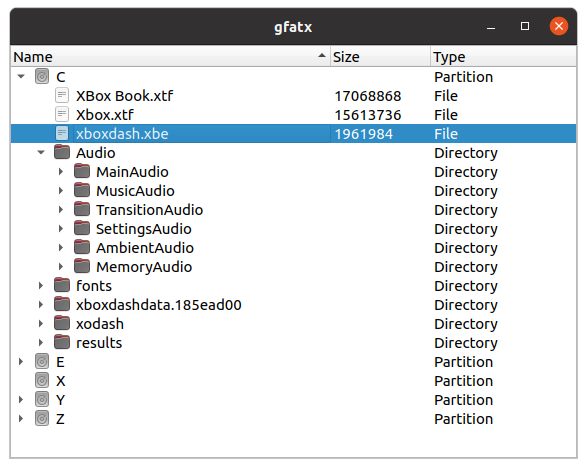

gfatx
=====

A graphical utility for working with FATX disk images, built around libfatx.

Note: This tool is in a very early state, and only has the functionality to browse filesystems in a disk at the moment.



## Build on Ubuntu
```
sudo apt install build-essential pkg-config cmake git qt6-base-dev qt6-tools-dev qt6-tools-dev-tools
cd /path/to/fatx
mkdir build
cd build
cmake ..
make gfatx
```

## Build on Windows
* Install Visual Studio 2019 Community
* Install Qt 6. I recommend using the Qt open source online installer.
* From Start menu, launch a "Qt 6.x.x + MSVC 2019" command prompt

```
"C:\Program Files (x86)\Microsoft Visual Studio\2019\Community\VC\Auxiliary\Build\vcvars32.bat" amd64
cd C:\path\to\fatx
mkdir build
cd build
cmake ..
cmake --build . --target gfatx
```

## Build on macOS
```
brew install pkgconfig qt@6
export PATH="/usr/local/opt/qt@6/bin:$PATH"
export LDFLAGS="-L/usr/local/opt/qt@6/lib"
export CPPFLAGS="-I/usr/local/opt/qt@6/include"
export PKG_CONFIG_PATH="/usr/local/opt/qt@6/lib/pkgconfig"
cd /path/to/fatx
mkdir build
cd build
cmake --build . --target gfatx
```
